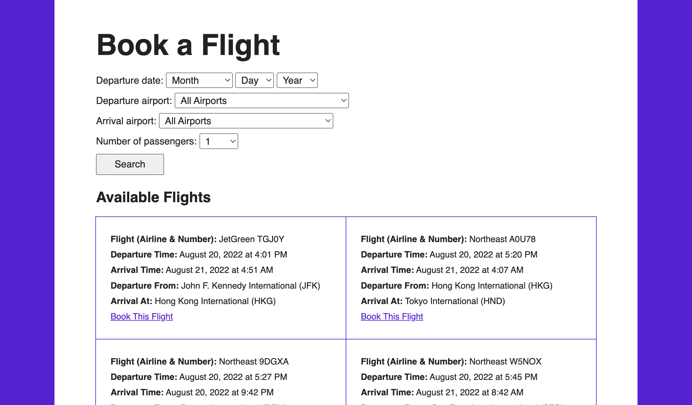

# Flight Booker

## Introduction

This project is an app that mimics the process, forms, and confirmation emails required to book a one-way flight. It is built using Ruby on Rails.

The project primarily demonstrates more complex Active Record and form concepts, such as nested attributes and collections for the `<select>` tag. A confirmation email feature was also added to demonstrate basic use of mailers.

## Preview

Run this project [here](https://rocky-shore-24771.herokuapp.com/). 
(Note: A confirmation email will not be sent unless the email address is on my whitelist of authorized recipients.)
